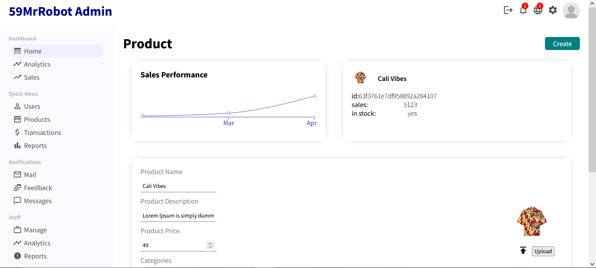

# Project Title

E-commerce Admin Site

## Demo Link:

Access my site at https://59mrrobot.github.io/ecommerce-admin/

## About The App:

This is an admin site, which serves as an extension of my [e-commerce site](https://59mrrobot.github.io/ecommerce-site/). Only users who are admins can access the site. The admins are allowed to view the sales statistics of the e-commerce site and they are also allowed to create, delete and update users and products. This site uses the [e-commerce api](https://github.com/59MrRobot/ecommerce-api).

## Screenshots:

## Technologies:

- React
- Typescript
- HTML
- SCSS
- Redux/Redux Persist
- Material UI
- Recharts
- Firebase
- Recharts
- Timeago.js

## Setup:

- Download or clone the repository.
- Install by running `npm install`.
- Start the server by running `npm start`.
- Visit the app at `http://localhost:3000/`.
